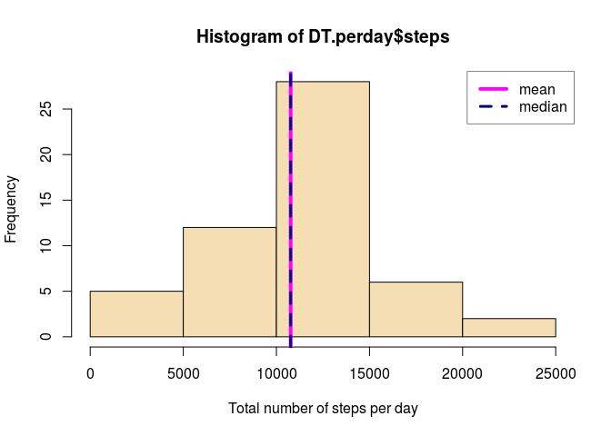
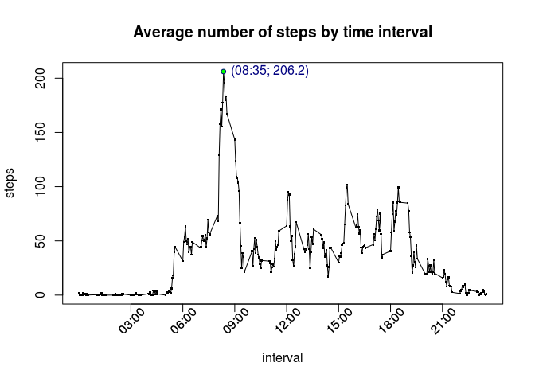
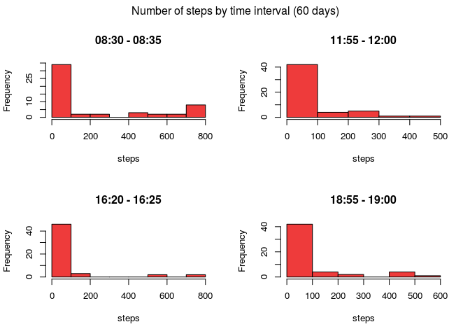
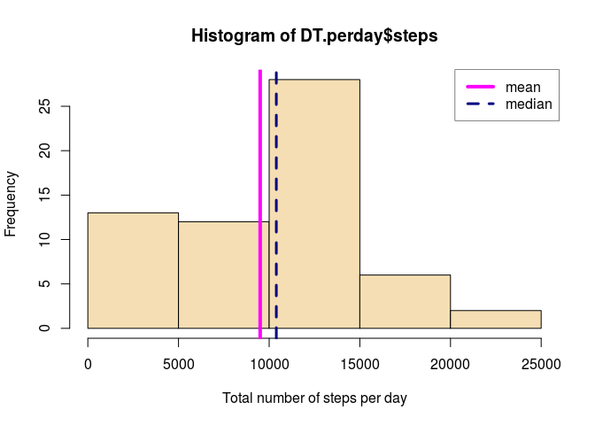
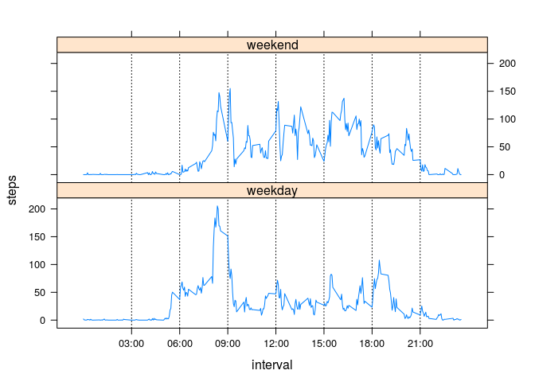

# Reproducible Research: Peer Assessment 1
This assignment is based on data from a personal activity monitoring device. Observations were collected from an anonymous individual during the months of October and November, 2012. Quantitative variable is the number of steps taken in 5 minute intervals each day.

The goal of the assignment is to make preliminary analysis of data and to provide a script which makes this research transparent, structured and reproducible. Technically the script utilises capabilities of R and Markdown. Notice that all figures given in text blocks are calculated on the fly using built-in chunks with R variables.

First, libraries were included to process data and draw plots. Also default background parameter has been changed to make all plots transparent.


```r
library('knitr')
library('rmarkdown')
library('data.table')
library('dplyr')
library('lattice')

par(bg = 'transparent')
```

## Loading and preprocessing the data

Then data has been loaded from file **'activity.csv'**. We use data.table class to make calculations faster.


```r
# data originally were loaded in .zip archive
if (!file.exists('activity.csv')) unzip('activity.zip')
DT <- data.table(read.csv('activity.csv', header = T, as.is = T, sep = ','))
# recode 'date' column into Date format
DT$date <- as.Date(strftime(DT$date))
# data.table preview
DT
```

```
##        steps       date interval
##     1:    NA 2012-10-01        0
##     2:    NA 2012-10-01        5
##     3:    NA 2012-10-01       10
##     4:    NA 2012-10-01       15
##     5:    NA 2012-10-01       20
##    ---                          
## 17564:    NA 2012-11-30     2335
## 17565:    NA 2012-11-30     2340
## 17566:    NA 2012-11-30     2345
## 17567:    NA 2012-11-30     2350
## 17568:    NA 2012-11-30     2355
```

The dataset contains **17568 rows** and **3 columns**:
 
* *steps* - number of steps taking in a 5-minute interval;
* *date* - The date on which the measurement was taken in YYYY-MM-DD format;
* *interval* - identifier for the 5-minute interval in which measurement was taken.

Observations cover period from 2012-10-01 to 2012-11-30, which makes totally 60 days.

## What is mean total number of steps taken per day?
At first step of exploratory analysis we ignore missing values. Our goal is to take a glimpse on data. Histogram below shows distribution of total number of steps per day.


```r
# total number of steps each day
DT.perday <- DT[, c('date', 'steps'), with = F][, lapply(.SD, sum), by = date]
# data.table preview
head(DT.perday)
```

```
##          date steps
## 1: 2012-10-01    NA
## 2: 2012-10-02   126
## 3: 2012-10-03 11352
## 4: 2012-10-04 12116
## 5: 2012-10-05 13294
## 6: 2012-10-06 15420
```

```r
# mean and median for variable 'steps'
aver <- c(mean(DT.perday$steps, na.rm = T),  median(DT.perday$steps, na.rm = T))
names(aver) <- c('mean', 'median')

# histogram of the total number of steps taken each day
hist(DT.perday$steps, col = 'wheat', xlab = 'Total number of steps per day')
abline(v = aver['mean'], lwd = 4, col = 'magenta')
abline(v = aver['median'], lwd = 3, lty = 2, col = 'navyblue')
legend('topright', legend = c('mean', 'median'), col = c('magenta', 'navyblue'), 
       lwd = c(4, 3), lty = c(1, 2), bg = 'transparent', box.lwd = 0.5)
```

\

First conclusions based on the histogram:

* Total number of steps per day seems to be normally distributed.
* Median (**10765** steps per day) almost equals mean (**10766** steps per day).


```r
# remove temporary data tables
rm(DT.perday)
```

## What is the average daily activity pattern?

In order to illustrate daily activity pattern we need to consider variable 'interval'. First 15 values of this variable are:

0, 5, 10, 15, 20, 25, 30, 35, 40, 45, 50, 55, 100, 105, 110.


Obviously, each value indicates an end of given 5 minute interval in 24 hour notation: 00:00, 00:05, 00:10,..., 01:00, 01:05, 01:10, and so on. Definition of user function **numToTime()**, which represents interval in this notation, is given below.


```r
# this function formats time interval neatly and supports vectorisation
numToTime <- function(x) {
    ifelse(x < 60, 
           res <- paste('00:', sprintf('%02d', x), sep = ''),
           res <- paste(sprintf('%02d', floor(x / 100)), ':',
                        sprintf('%02d', x %% 100), sep = ''))
    return(res)
}
```

At this step of analysis new data table **DT.perint** was created. This dataset contains mean number of steps in 5 minute interval. Variable **'steps'** have been agregated omitting missing values.


```r
# summarize (calc mean) steps by 5 min interval
DT.perint <- DT[, c('steps', 'interval'), with  = F][, lapply(.SD, mean, na.rm = T), by = interval]
# data.table preview
DT.perint
```

```
##      interval     steps
##   1:        0 1.7169811
##   2:        5 0.3396226
##   3:       10 0.1320755
##   4:       15 0.1509434
##   5:       20 0.0754717
##  ---                   
## 284:     2335 4.6981132
## 285:     2340 3.3018868
## 286:     2345 0.6415094
## 287:     2350 0.2264151
## 288:     2355 1.0754717
```

```r
# plot of average steps taken per 5 min interval
with(DT.perint, plot(interval, steps, type = 'l', main = 'Average number of steps by time interval', xaxt = 'n'))
with(DT.perint, points(interval, steps, pch = '.', cex = 2.5))
# find maximum
max.point <- c(as.numeric(DT.perint[which(steps == max(steps)), 'interval', with=FALSE]), max(DT.perint$steps))
names(max.point) <- c('x', 'y')
# add maximum point to plot
with(DT.perint, points(max.point['x'], max.point['y'], pch = 21, col = 'navyblue', bg = 'green', cex = 0.8))
text(max.point['x'], max.point['y'], pos = 4, col = 'navyblue', 
     labels = paste('(', numToTime(max.point['x']), '; ', round(max.point['y'], 1), ')', sep = ""))
# format horizontal axis
at.cust <- seq(300, 2100, by=300)
axis(1, at=at.cust, labels = FALSE)
text(at.cust - 10, par("usr")[3] - 6, labels=numToTime(at.cust), srt = 45, pos = 1, xpd = TRUE)
```

\

Time series plot above shows daily activity per 5 minute intervals averaged by 60 days. Maximum number of steps corresponds to 08:35. One can also see lesser peacks around 12:00, 16:30 and 19:00 o'clock. About 6 hours of nighttime (23:30 - 5:30) are characterized by zero activity.


```r
# Remove temporary data tables
rm(DT.perint)
```


## Imputing missing values

At this point we are going to fill the gaps in data. Let's see how much missing values there are in each column of origin dataset.


```r
# number of nas in variables
DT[, sapply(.SD, function(x) sum(is.na(x)))]
```

```
##    steps     date interval 
##     2304        0        0
```

So, there are 2304 observations of variable 'steps' we need to replace. Additional plot below shows that distribution of steps in the same time interval among 60 days is highly scewed. That's why median is appropriate estimator for average value of steps in given time interval. Side effect of using median in this particular case is the prevalence of zero medians at most of time intervals. Nevertheless, median is used to avoid positive bias in the number of steps. 


```r
# distributions of 'steps' in the same 'interval'
par(mfrow = c(2, 2), oma = c(0, 0, 1.5, 0))
with(DT[interval == 835], hist(steps, main = '08:30 - 08:35', col = 'brown2'))
with(DT[interval == 1200], hist(steps, main = '11:55 - 12:00', col = 'brown2'))
with(DT[interval == 1625], hist(steps, main = '16:20 - 16:25', col = 'brown2'))
with(DT[interval == 1900], hist(steps, main = '18:55 - 19:00', col = 'brown2'))
mtext('Number of steps by time interval (60 days)', outer = TRUE)
```

\

```r
# set plot panel back to default
par(mfrow = c(1, 1))
```

Missing values are to be replaced with medians for corresponding time interval. Medians were calculated and saved in the **DT.filled** table in temporary column named **'medInt'**. This values were used to fill NAs in the **'steps'** column.


```r
# copy data to new table
DT.filled <- copy(DT)
# data.table preview
head(DT.filled[interval == 900])
```

```
##    steps       date interval
## 1:    NA 2012-10-01      900
## 2:     0 2012-10-02      900
## 3:     0 2012-10-03      900
## 4:     0 2012-10-04      900
## 5:   530 2012-10-05      900
## 6:    30 2012-10-06      900
```

```r
# calculate medians
DT.filled[, medInt := median(steps, na.rm = TRUE), interval]
# data.table preview
head(DT.filled[interval == 900])
```

```
##    steps       date interval medInt
## 1:    NA 2012-10-01      900     20
## 2:     0 2012-10-02      900     20
## 3:     0 2012-10-03      900     20
## 4:     0 2012-10-04      900     20
## 5:   530 2012-10-05      900     20
## 6:    30 2012-10-06      900     20
```

```r
# fill in all missing values
DT.filled <- transform(DT.filled, 
                       steps = ifelse(is.na(steps), medInt, steps))[, c('steps', 'date', 'interval'), with = F]
# data.table preview
head(DT.filled[interval == 900])
```

```
##    steps       date interval
## 1:    20 2012-10-01      900
## 2:     0 2012-10-02      900
## 3:     0 2012-10-03      900
## 4:     0 2012-10-04      900
## 5:   530 2012-10-05      900
## 6:    30 2012-10-06      900
```

```r
# recalculation of total number of steps each day
DT.perday <- DT.filled[, c('date', 'steps'), with = F][, lapply(.SD, sum), by = date]
# data.table preview
head(DT.perday)
```

```
##          date steps
## 1: 2012-10-01  1141
## 2: 2012-10-02   126
## 3: 2012-10-03 11352
## 4: 2012-10-04 12116
## 5: 2012-10-05 13294
## 6: 2012-10-06 15420
```

```r
# mean and median for variable 'steps'
aver.fna <- c(mean(DT.perday$steps, na.rm = T), median(DT.perday$steps, na.rm = T))
names(aver.fna) <- c('mean', 'median')

# histogram of the total number of steps taken each day
hist(DT.perday$steps, col = 'wheat', xlab = 'Total number of steps per day')
abline(v = aver.fna['mean'], lwd = 4, col = 'magenta')
abline(v = aver.fna['median'], lwd = 3, lty = 2, col = 'navyblue')
legend('topright', legend = c('mean', 'median'), col = c('magenta', 'navyblue'), 
       lwd = c(4, 3), lty = c(1, 2), bg = 'transparent', box.lwd = 0.5)
```

\

Filling missing values affect on mean, median and distribution of data. Specifically:

* Distribution of total number of steps per day looks less like normal (1st bar is higher than 2nd).
* Median now equals to **10395** steps per day (370 less than original).
* Mean = **9504** steps per day (1262  less than original).
* Mean and median differ and belong to adjacent intervals of histogram.


```r
# remove temporary data tables
rm(DT.perday, DT)
```

## Are there differences in activity patterns between weekdays and weekends?

Finally, we need to analyse how days of the week affect activity patterns. Specifically, we need to separate weekdays from weekends. Code below adds new factor variable **'dayClass'** to data table with filled missing values (**DT.filled**). Then table **DT.perint** is recalculated. Result is shown at the plot with two facets.


```r
# create new factor variable
DT.filled[, dayClass:=factor(ifelse(wday(date)==7 | wday(date)==1,
                             'weekend', 'weekday'))]

# average number of steps each interval by day class
DT.perint <- DT.filled[, c('steps', 'interval', 'dayClass'), with=F][, lapply(.SD, mean), by = c('interval', 'dayClass')]

# plot (lattice package)
my.plot <- xyplot(steps ~ interval | dayClass, data = DT.perint, layout = c(1, 2), type = 'l',
                  scales = list(x=list(at = at.cust, labels = numToTime(at.cust))))
# add grid lines to plot
update(my.plot, panel = function(...) {
    panel.abline(v = at.cust, lty = "dotted", col = "black")
    panel.xyplot(...)
})
```

\

Judging by this plot:

* Average number of steps on intervals from 09:00 to 18:00 is slightly higher and has higher variance at weekends. This distingtion can be explained by office hours.
* On the contrary, intervals from 05:00 to 09:00 and from 18:00 to 21:00 show more activity at weekdays. Moreover, as curve increases in morning hours and falls in evening hours, one can assume that way from home to work and back again may be the leading factor here.
* Further investigation may be conducted using statistical tests on the identified intervals.
